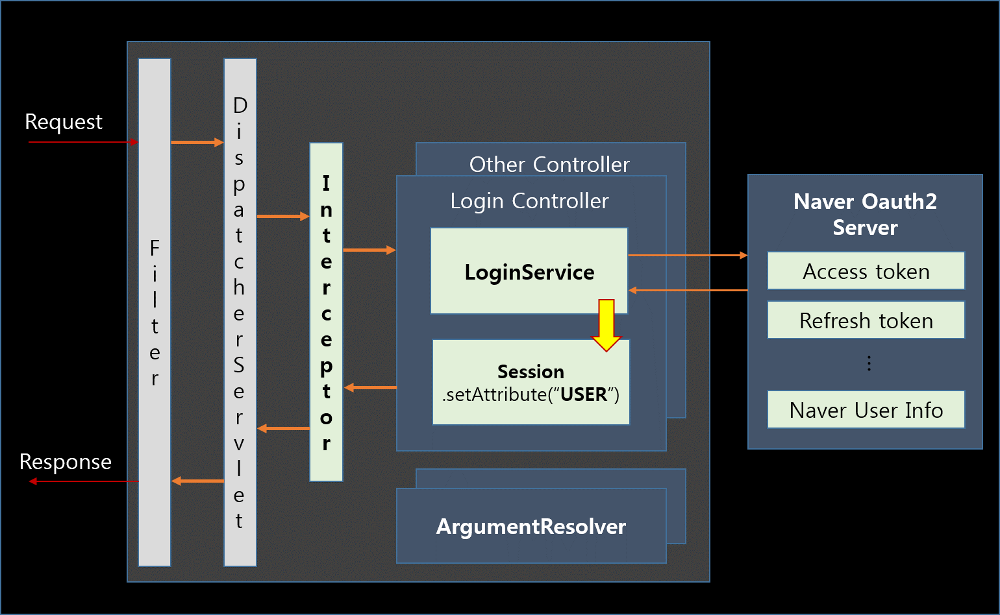
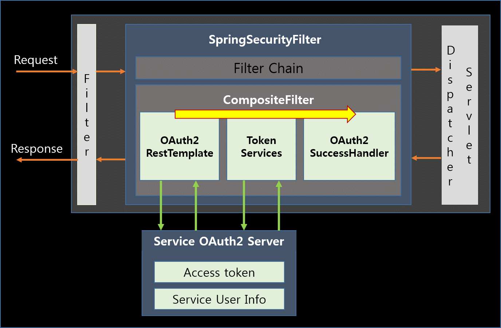
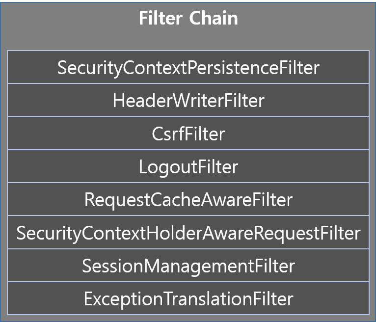
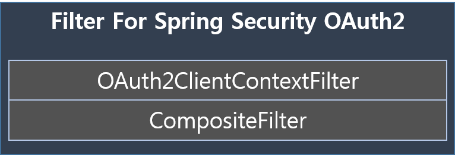
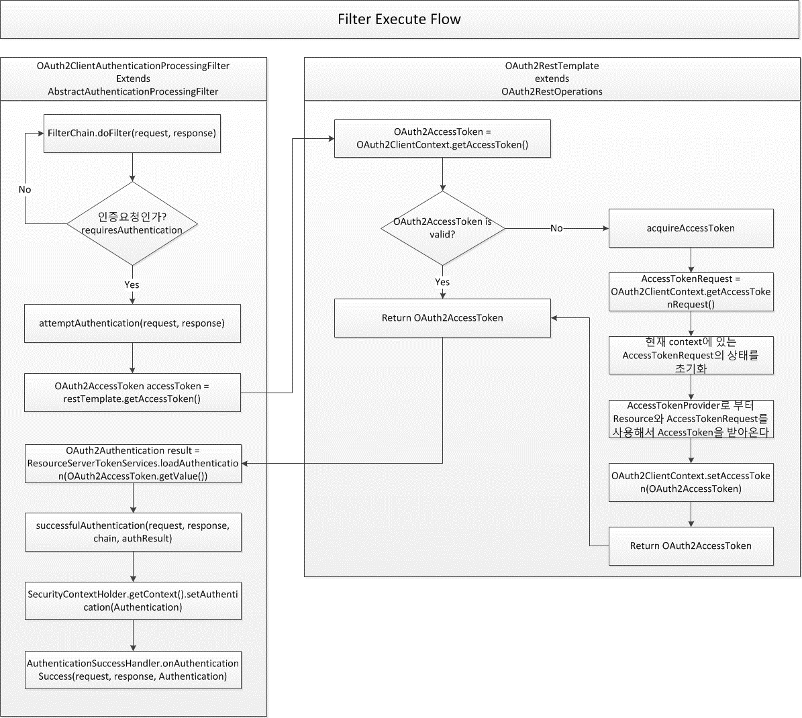

## Spring <span style="color:#99FF00">Security</span><br>
### **<span style="color:#00ff99">By 각자바스</span>**
---
|**Authentication**|**Authorization**|
|:-:|:-:|
|시스템 접근 시, 등록된 사용자인지 여부를 확인하는 것| 시스템 접근 후, 인증된 사용자에게 권한을 부여하는 것|
|시스템 로그인|권한에따른 접근 권한<br> 사용자 등급(일반/관리자)|

---
## **Why Spring Security?**

---

### 우리 시스템의 **<span style="color:#00ff99">"이슈"</span>**
1. 시스템에 **Authentication** 만 존재
2. Login 과정의 로직 분리가 확실하게 되어있지 않다




---
### **<span style="color:#00ff99">"해결방안"</span>** - Spring Security 활용
1. Spring MVC와의 분리
2. Role 기반의 접근 권한 지원



---
## **Adapt Spring Security (OAuth2)**

---

### 1. Spring Security Dependency 추가

```xml
<dependency>
    <groupId>org.springframework.security</groupId>
    <artifactId>spring-security-taglibs</artifactId>
    <version>SPRING_SECURITY_VERSION</version>
</dependency>

<dependency>
    <groupId>org.springframework.security.oauth</groupId>
    <artifactId>spring-security-oauth2</artifactId>
    <version>SPRING_SECURITY_OAUTH2_VERSION</version>
</dependency>
```

---

### 2. Spring Security Filters ↓

+++
#### Spring Security Filter Chain

+++
#### OAuth2를 사용하기 위해서 추가한 Filter



---
### 3. 인증 및 권한 제어 3가지 방법
<span style="float: left">1) @Secured</span> <br>

```java
@Secured("ROLE_USER")
@Secured("ROLE_ADMIN")
```

<span style="float: left">2) Configure in WebSecurityConfigurerAdapter</span> <br>

```java
@Override
protected void configure(HttpSecurity http) throws Exception {
    http
        .authorizeRequests()
        .antMatchers("/index").access("ROLE_ADMIN");
        .antMatchers("/**").access("ROLE_USER");
}
```

<span style="float: left">3) xml file</span> <br>

```xml
<intercept-url pattern="/index" access="hasRole('ADMIN')"/>
<intercept-url pattern="/**" access="hasRole('USER')" />
```

---
### 4. OAuth2 사용을 위한 필터 확장 및 등록 방법
<span style="float: left">1) 다양한 리소스들 생성</span><br>

```java
public AuthorizationCodeResourceDetails naver() {
    AuthorizationCodeResourceDetails naverDetails
          = new AuthorizationCodeResourceDetails();
    ...
    return details;
}

private AuthorizationCodeResourceDetails facebook() {
    AuthorizationCodeResourceDetails facebookDetails
          = new AuthorizationCodeResourceDetails();
    ...
    return details;
}
```

+++
<span style="float: left">2) 커스텀 필터 생성</span><br>
다양한 리소스를 간편하게 등록해서 확장 가능

```java
@Bean("sso.filter")
public Filter ssoFilter() {
    List<Filter> filters = new ArrayList<>();

    OAuth2ClientAuthenticationProcessingFilter naver
            = new OAuth2ClientAuthenticationProcessingFilter("/naver_login");
    facebook.setRestTemplate(naver(), oauth2ClientContext));
    facebook.setTokenServices(new UserTokenService(...));
    facebook.setAuthenticationSuccessHandler(
            new OAuth2SuccessHandler("naver", userService));
    filters.add(naver);

    //다른 서비스도 위와 동일하게 필터 설정

    CompositeFilter filter = new CompositeFilter();
    filter.setFilters(filters);
    return filter;
}
```

+++
<span style="float: left">3) CompositeFilter를 생성 후 필터 등록</span><br>

```java
protected void configure(HttpSecurity http) throws Exception {
    //...
    http
        .addFilterAfter(oauth2ClientContextFilter,
                ExceptionTranslationFilter.class)
        .addFilterBefore((Filter) context.getBean("sso.filter"),
                FilterSecurityInterceptor.class);
    //...
}
```

---
### 5. 필터 동작 과정


---
### 6. Authorization 결과물
- 사진 2장
    - ROLE_USER 접근 불가.jpg + log
    - ROLE_ADMIN 접근 승인.jpg + log
---
## 시행착오

- Spring Security Boot에는 이렇게 되어 있었는데 Spring Security에서는 달랐다...

---
결론

- Spring MVC와 Spring Security의 완전한 로직 분리


---
## Q&A
#### 감사합니다.
